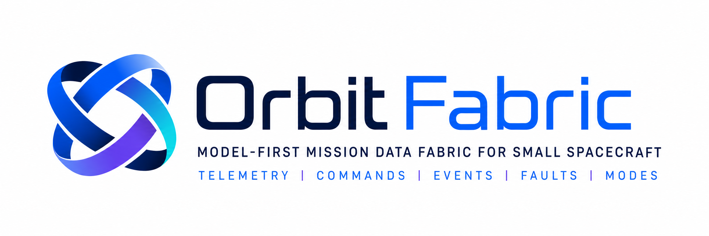

<div align="center">
  
</div>

<br>

<div align="center">

**Model-first Mission Data Fabric for small spacecraft**

Define telemetry, commands, events, faults, modes, packets, payload contracts, data products, contact/downlink assumptions, commandability/autonomy contracts, operational scenarios, runtime-facing contract bindings, ground-facing integration artifacts, Core-owned introspection surfaces, entity index surfaces, relationship manifest surfaces and compatibility classification references once.
Validate them, document them, simulate them and generate deterministic integration, inspection and compatibility artifacts from the same source of truth.

</div>

---

## Overview

OrbitFabric is a **model-first Mission Data Fabric** for small spacecraft.

It lets teams define mission data contracts once, using a structured Mission Model, and then reuse that contract across validation, documentation, testing, simulation, runtime-facing bindings, ground-facing integration artifacts, Core-owned introspection surfaces and downstream inspection tools.

OrbitFabric is not a flight software framework, not a ground segment and not a spacecraft dynamics simulator.

It is the contract layer between:

```text
mission design
onboard software
simulation
testing
documentation
runtime-facing integration
ground integration
downstream inspection tools
```

> Define once. Validate. Simulate. Test. Document. Integrate.

---

## Current Status

OrbitFabric is currently at `v0.10.0 - Stability and Compatibility Contract`.

v0.10.0 introduces the first stability and compatibility classification baseline before v1.0.0.

It builds on:

```text
v0.8.1  -> model_summary.json
v0.8.2  -> entity_index.json
v0.9.0  -> relationship_manifest.json
v0.10.0 -> stability and compatibility classification
```

The current Core-owned structured surface chain is:

```text
model_summary.json          -> What contract domains are present?
entity_index.json           -> What contract entities are defined?
relationship_manifest.json  -> How are indexed contract entities related?
```

v0.10.0 adds compatibility classification references for:

```text
Mission Model stability expectations
CLI command stability
JSON report compatibility expectations
lint rule code evolution
generated and exported surface stability
scenario evidence stability
release compatibility policy
```

OrbitFabric does not generate a ground segment, mission control system, telemetry archive, command uplink service, operator console, decoder runtime, database, Yamcs integration, OpenC3 integration or XTCE-compliant mission database.

It generates deterministic, inspectable, tool-neutral artifacts derived from the validated Mission Model.

The current repository includes:

- the `v0.2.1 - Payload Contract Model` vertical slice;
- the `v0.2.3 - Mission Data Chain Roadmap Alignment` direction;
- the `v0.3.0 - Data Product and Storage Contracts` vertical slice;
- the `v0.4.0 - Contact Windows and Downlink Flow Contracts` vertical slice;
- the `v0.5.0 - Commandability and Autonomy Contracts` vertical slice;
- the `v0.6.0 - End-to-End Mission Data Flow Evidence` vertical slice;
- the `v0.7.0 - Generated Runtime Skeletons` vertical slice;
- the `v0.8.0 - Ground Integration Artifacts` vertical slice;
- the `v0.8.1 - Contract Introspection Surface` vertical slice;
- the `v0.8.2 - Entity Index Surface` vertical slice;
- the `v0.9.0 - Relationship Manifest Surface and Extensibility Boundary` vertical slice;
- the `v0.10.0 - Stability and Compatibility Contract` vertical slice.

The current vertical slice is functional:

- Mission Model YAML loading;
- structural validation;
- semantic linting;
- generated Markdown documentation;
- scenario YAML loading and validation;
- deterministic scenario execution;
- JSON lint and simulation reports;
- RuntimeContract construction;
- `orbitfabric gen runtime` generation;
- C++17 runtime-facing contract bindings;
- host-build smoke validation for generated C++17 bindings;
- GroundContract construction;
- `orbitfabric gen ground` generation;
- generic ground contract manifest;
- JSON ground dictionaries;
- CSV ground dictionaries;
- human-reviewable ground Markdown artifacts;
- `orbitfabric export model-summary` generation;
- Core-owned `model_summary.json` contract introspection report;
- `orbitfabric export entity-index` generation;
- Core-owned `entity_index.json` entity index report;
- `orbitfabric export relationship-manifest` generation;
- Core-owned `relationship_manifest.json` candidate relationship report;
- stability and compatibility classification references;
- synthetic demo mission: `demo-3u`.

The relationship manifest candidate surface admits 19 deliberately narrow relationship families.

For `examples/demo-3u/mission`, the current manifest emits 46 relationship records across 17 emitted relationship families.

It is not a graph engine, dependency graph, plugin API, Studio API, runtime behavior layer or ground behavior layer.

The repository also includes a growing set of example mission slices:

- `examples/demo-3u/` - synthetic clean-room demo mission;
- `examples/university-cubesat-minislice/` - generic university CubeSat minislice;
- `examples/oresat-inspired-minislice/` - public-material-derived low-power / beacon / constrained-downlink minislice;
- `examples/finch-inspired-minislice/` - public-material-derived imaging acquisition / ADCS readiness / compression / constrained-downlink minislice;
- `examples/spacelab-inspired-communications-minislice/` - public-material-derived TT&C / OBDH / beacon / telecommanded data-request / decoder-evidence minislice.

The `*-inspired-*` examples are conceptual public demos. They are not official models, not endorsed by the original project teams, and do not imply adoption of OrbitFabric by those teams.

Current verified baseline:

```text
ruff check .
-> passing

pytest
-> passing

mkdocs build --strict
-> passing

cmake -S generated/runtime/cpp17 -B generated/runtime/cpp17/build
cmake --build generated/runtime/cpp17/build
-> passing after orbitfabric gen runtime

orbitfabric gen ground examples/demo-3u/mission/
-> passing

orbitfabric export model-summary examples/demo-3u/mission/ --json generated/reports/model_summary.json
-> passing

orbitfabric export entity-index examples/demo-3u/mission/ --json generated/reports/entity_index.json
-> passing

orbitfabric export relationship-manifest examples/demo-3u/mission/ --json generated/reports/relationship_manifest.json
-> passing
```

---

## What OrbitFabric Is

OrbitFabric is a Mission Data Contract framework.

It models:

- telemetry;
- commands;
- events;
- faults;
- operational modes;
- packets;
- scenarios;
- persistence and downlink policies;
- optional Payload / IOD Payload Contracts;
- optional Data Product and Storage Contracts;
- optional Contact Windows and Downlink Flow Contracts;
- optional Commandability and Autonomy Contracts;
- contract-level Mission Data Flow Evidence;
- generated runtime-facing contract bindings;
- generated ground-facing integration artifacts;
- Core-owned contract introspection surfaces;
- Core-owned entity index surfaces;
- Core-owned relationship manifest surfaces;
- stability and compatibility classifications before v1.0.0.

The data-flow evidence chain connects:

```text
command expected effect
        -> data product
        -> storage intent
        -> downlink intent
        -> eligible downlink flow
        -> matching contact window
        -> scenario evidence
        -> generated documentation
        -> JSON report evidence
        -> runtime-facing bindings
        -> ground-facing artifacts
        -> model summary surface
        -> entity index surface
        -> relationship manifest surface
        -> compatibility classification
```

The structured surface chain is:

```text
Mission Model
        -> canonical loader
        -> validated MissionModel
        -> model_summary.json
        -> entity_index.json
        -> relationship_manifest.json
        -> downstream tools consume Core-owned structured surfaces
```

Payload, Data Product, Contact/Downlink, Commandability/Autonomy, Data-Flow Evidence, Runtime Contract Binding, Ground Integration Artifacts, Contract Introspection Surfaces, Entity Index Surfaces, Relationship Manifest Surfaces and Stability/Compatibility References are part of the Mission Data Contract architecture. They do not describe payload firmware, payload drivers, hardware buses, onboard services, physical payload simulation, real storage execution, real contact scheduling, real downlink runtime behavior, live uplink services, operator authentication, command queues, onboard schedulers, autonomy runtime, real FDIR behavior or live ground operations.

---

## What OrbitFabric Is Not

OrbitFabric is not:

- a flight-ready onboard runtime;
- a replacement for cFS or F Prime;
- a replacement for Yamcs or OpenC3;
- a spacecraft physics simulator;
- a Basilisk alternative;
- a CCSDS/PUS/CFDP implementation;
- a hardware abstraction layer;
- a CubeSat tutorial;
- a ground segment;
- a mission control system;
- an operator console;
- a telemetry archive;
- a command uplink service;
- a payload firmware framework;
- a payload driver framework;
- a payload physical simulator;
- a payload data processing pipeline;
- an onboard storage runtime;
- a downlink runtime;
- an orbit propagator;
- an RF/link budget simulator;
- a real contact scheduler;
- a command dispatch runtime;
- an onboard scheduler;
- a HAL or RTOS abstraction;
- a relationship graph;
- a dependency graph;
- a plugin execution layer;
- a plugin API;
- a Studio-specific backend API;
- schema migration tooling;
- a JSON Schema publication layer;
- a v1.0 compatibility guarantee.

Generated Runtime Skeletons in v0.7.0 are runtime-facing contract bindings.

Ground Integration Artifacts in v0.8.0 are ground-facing contract exports.

Contract Introspection Surface in v0.8.1 is a Core-derived read-only model summary.

Entity Index Surface in v0.8.2 is a Core-derived read-only entity index.

Relationship Manifest Surface in v0.9.0 is a Core-derived read-only candidate relationship manifest.

Stability and Compatibility Contract in v0.10.0 is a classification baseline for public, preview, candidate, generated and internal surfaces before v1.0.0.

None of them is flight software, ground software, plugin execution or a visual modeling tool.

---

## Demo Mission: `demo-3u`

The repository includes a synthetic clean-room demo mission:

```text
examples/demo-3u/
├── mission/
│   ├── spacecraft.yaml
│   ├── subsystems.yaml
│   ├── modes.yaml
│   ├── telemetry.yaml
│   ├── commands.yaml
│   ├── events.yaml
│   ├── faults.yaml
│   ├── packets.yaml
│   ├── policies.yaml
│   ├── payloads.yaml
│   ├── data_products.yaml
│   ├── contacts.yaml
│   └── commandability.yaml
└── scenarios/
    ├── battery_low_during_payload.yaml
    ├── nominal_payload_acquisition.yaml
    └── payload_data_flow_evidence.yaml
```

The demo includes:

```text
Payload Contract
        -> Data Product Contract
        -> Storage Intent
        -> Downlink Intent
        -> Contact Window Assumption
        -> Downlink Flow Contract
        -> Commandability and Autonomy Contract
        -> End-to-End Mission Data Flow Evidence
        -> Runtime-Facing Contract Bindings
        -> Ground-Facing Integration Artifacts
        -> Contract Introspection Surface
        -> Entity Index Surface
        -> Relationship Manifest Surface
        -> Stability and Compatibility Classification
```

---

## Installation for Local Development

Create and activate a Python virtual environment:

```bash
python3 -m venv .venv
source .venv/bin/activate
python -m pip install --upgrade pip
python -m pip install -e ".[dev]"
```

Verify the CLI:

```bash
orbitfabric --version
orbitfabric --help
```

Expected:

```text
orbitfabric 0.10.0
```

---

## Run Mission Lint

```bash
orbitfabric lint examples/demo-3u/mission/ \
  --json generated/reports/lint_report.json
```

Expected result:

```text
Result: PASSED
```

---

## Export Core-Owned Structured Surfaces

Generate the domain-level model summary report:

```bash
orbitfabric export model-summary examples/demo-3u/mission/ \
  --json generated/reports/model_summary.json
```

Generate the entity-level index report:

```bash
orbitfabric export entity-index examples/demo-3u/mission/ \
  --json generated/reports/entity_index.json
```

Generate the relationship-level manifest report:

```bash
orbitfabric export relationship-manifest examples/demo-3u/mission/ \
  --json generated/reports/relationship_manifest.json
```

Generated files:

```text
generated/reports/model_summary.json
generated/reports/entity_index.json
generated/reports/relationship_manifest.json
```

`model_summary.json` answers:

```text
What contract domains are present in this mission?
```

`entity_index.json` answers:

```text
What contract entities are defined in this mission?
```

`relationship_manifest.json` answers:

```text
How are indexed mission contract entities related?
```

These surfaces are read-only Core-owned reports. They are not graph engines, plugin APIs or Studio-specific APIs.

---

## Review Stability and Compatibility References

v0.10.0 adds the first compatibility classification baseline before v1.0.0.

Key references:

```text
Stability and Compatibility Contract
Mission Model Stability Contract
CLI Contract v1 Preview
Generated Surfaces Stability
Lint Rule Code Stability
JSON Report Compatibility
Scenario Evidence Stability
Release Compatibility Policy
```

These references classify existing surfaces.

They do not add Mission Model semantics, CLI behavior, JSON report fields, generated surfaces, lint diagnostics, scenario behavior, schema migration tooling, JSON Schema publication, runtime behavior, ground behavior, plugin execution or a stable v1.0 guarantee.

---

## Generate Mission Documentation

Generate Markdown documentation from the Mission Model:

```bash
orbitfabric gen docs examples/demo-3u/mission/
```

---

## Generate Runtime Contract Bindings

Generate C++17 runtime-facing contract bindings:

```bash
orbitfabric gen runtime examples/demo-3u/mission/
```

Validate the generated C++17 contract surface with CMake:

```bash
cmake -S generated/runtime/cpp17 -B generated/runtime/cpp17/build
cmake --build generated/runtime/cpp17/build
```

This is host-build smoke validation only.

It does not produce flight software.

---

## Generate Ground Integration Artifacts

Generate the generic ground-facing mission data package:

```bash
orbitfabric gen ground examples/demo-3u/mission/
```

These files are ground-facing contract exports.

They are not a ground runtime, decoder, telemetry archive, database, operator console, Yamcs integration, OpenC3 integration or XTCE-compliant mission database.

---

## Run Scenario Simulation

Run the battery-low recovery scenario:

```bash
orbitfabric sim examples/demo-3u/scenarios/battery_low_during_payload.yaml \
  --json generated/reports/battery_low_during_payload_report.json \
  --log generated/logs/battery_low_during_payload.log
```

Run the data-flow evidence scenario:

```bash
orbitfabric sim examples/demo-3u/scenarios/payload_data_flow_evidence.yaml \
  --json generated/reports/payload_data_flow_evidence_report.json \
  --log generated/logs/payload_data_flow_evidence.log
```

Expected result:

```text
Result: PASSED
```

---

## Run Tests

```bash
ruff check .
pytest
mkdocs build --strict
```

Current expected baseline:

```text
ruff check .           -> All checks passed
pytest                 -> passing
mkdocs build --strict  -> passing
```

---

## Generated Artifacts

The current vertical slice can produce:

```text
generated/
├── docs/
├── reports/
│   ├── model_summary.json
│   ├── entity_index.json
│   └── relationship_manifest.json
├── logs/
├── runtime/
│   └── cpp17/
└── ground/
    └── generic/
```

Generated artifacts are reproducible outputs. They are not the source of truth.

The source of truth remains:

```text
examples/demo-3u/mission/*.yaml
examples/demo-3u/scenarios/*.yaml
```

---

## Documentation

Published documentation is available at:

```text
https://farotech.github.io/orbitfabric/
```

Useful entry points:

- `docs/PROJECT_CHARTER.md`
- `docs/CLEAN_ROOM_POLICY.md`
- `docs/ARCHITECTURE.md`
- `docs/ROADMAP.md`
- `docs/DEVELOPMENT.md`
- `docs/QUICKSTART.md`
- `docs/DEMO_WALKTHROUGH.md`
- `docs/reference/runtime-contract-bindings.md`
- `docs/reference/ground-integration-artifacts.md`
- `docs/reference/contract-introspection-surface.md`
- `docs/reference/entity-index-surface.md`
- `docs/reference/relationship-manifest-surface.md`
- `docs/reference/stability-compatibility-contract.md`
- `docs/reference/mission-model-stability-contract.md`
- `docs/reference/cli-contract-v1.md`
- `docs/reference/generated-surfaces-stability.md`
- `docs/reference/lint-rule-code-stability.md`
- `docs/reference/json-report-compatibility.md`
- `docs/reference/scenario-evidence-stability.md`
- `docs/reference/release-compatibility-policy.md`
- `docs/releases/v0.10.0.md`
- `docs/adr/`

Build the documentation site locally:

```bash
mkdocs build --strict
```

Preview locally:

```bash
mkdocs serve
```

---

## Clean-Room Policy

OrbitFabric is developed as a clean-room open-source project.

Do not add proprietary mission data, private architectures, private protocols, real operational logs, non-public payload details, real bus maps, real pinouts, employer/customer-owned code or NDA-protected material.
