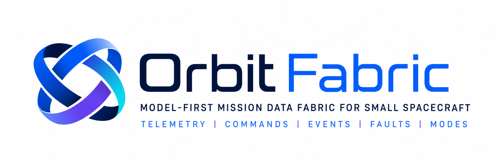

<div align="center">
  
</div>

<br>

<p align="center">
  <strong>Define once. Validate. Simulate. Test. Document. Integrate.</strong>
</p>

# OrbitFabric

OrbitFabric is a model-first Mission Data Fabric for small spacecraft.

It provides a disciplined way to define a spacecraft Mission Data Contract once and reuse the same validated semantics across software integration, documentation, host-side scenario evidence, generated contract artifacts, machine-readable inspection surfaces and external ecosystem integrations.

OrbitFabric is intentionally not a flight software framework, ground segment, mission control system or spacecraft simulator. Its job is narrower and more foundational: keep mission data semantics explicit, consistent, reviewable and reusable across the engineering lifecycle.

## Why OrbitFabric exists

Small spacecraft projects often repeat the same mission information in many places:

```text
flight software structures
ground dictionaries
test fixtures
simulation inputs
documentation
payload integration notes
fault handling logic
storage and downlink assumptions
operations procedures
external tool configuration
```

Each independent copy can drift.

OrbitFabric addresses that problem by making the Mission Data Contract explicit and machine-readable. Core loads that contract once, validates it, derives structured evidence and exports controlled surfaces that downstream tools can consume without rebuilding mission meaning for themselves.

The central rule is:

```text
The Mission Model is the semantic source of truth.
OrbitFabric Core owns Mission Data Contract interpretation.
Derived artifacts remain derived.
Downstream tools consume explicit Core-owned facts.
```

## Mission Data Contract

The Mission Data Contract is expressed as a multi-file YAML Mission Model.

The current stable model covers:

```text
spacecraft identity and mission metadata
subsystems
operational modes and mode transitions
telemetry
commands
events
faults
packets
policies
payload contracts
data products
storage and retention intent
contact and downlink assumptions
commandability
autonomy and recovery intent
```

Operational scenarios are defined separately in YAML and exercise the contract as deterministic host-side evidence.

Typical mission layout:

```text
mission/
  spacecraft.yaml
  subsystems.yaml
  modes.yaml
  telemetry.yaml
  commands.yaml
  events.yaml
  faults.yaml
  packets.yaml
  policies.yaml
  payloads.yaml
  data_products.yaml
  contacts.yaml
  commandability.yaml

scenarios/
  *.yaml
```

Optional model domains remain optional where documented. Their documented field names, meanings, identifiers, references and controlled values are compatibility-sensitive from the stable v1 Mission Data Contract onward.

## What Core does

OrbitFabric Core turns the Mission Model into a coherent engineering workflow.

### Load, validate and lint

Core performs structural validation and semantic linting, with stable diagnostic ownership and machine-readable lint reports.

```bash
orbitfabric inspect mission examples/demo-3u/mission/
orbitfabric lint examples/demo-3u/mission/
```

### Execute deterministic scenario evidence

Scenarios provide host-side evidence for declared mission behavior and expectations.

```bash
orbitfabric validate scenario examples/demo-3u/scenarios/battery_low_during_payload.yaml
orbitfabric sim examples/demo-3u/scenarios/battery_low_during_payload.yaml
```

Scenario evidence is not flight execution and not a spacecraft dynamics simulation.

### Generate mission documentation

Core generates documentation directly from the validated Mission Model.

```bash
orbitfabric gen docs examples/demo-3u/mission/
orbitfabric gen data-flow examples/demo-3u/mission/
```

Generated Markdown is reviewable and reproducible, but it is not the source of truth.

### Generate runtime-facing contract bindings

```bash
orbitfabric gen runtime examples/demo-3u/mission/
```

The current `cpp17` profile generates deterministic identifiers, metadata registries, command argument structures, abstract adapter interfaces and a C++17 host-build smoke target.

These outputs are contract bindings. They do not implement onboard scheduling, command dispatch, telemetry polling, drivers, RTOS behavior or flight logic.

### Generate ground-facing contract artifacts

```bash
orbitfabric gen ground examples/demo-3u/mission/
```

The current generic ground profile generates reviewable JSON, CSV and Markdown contract artifacts.

These outputs are integration artifacts. They do not implement a telemetry archive, database, operator console, command uplink service or live ground segment.

## Core-owned machine-readable surfaces

OrbitFabric exposes structured surfaces so downstream tools do not need to parse terminal text, generated Markdown or raw YAML independently.

Stable Core-owned surfaces include:

```text
lint JSON report
simulation JSON report
model_summary.json
entity_index.json
relationship_manifest.json for admitted families
mission_snapshot.json
Core Integration Input Set
```

They answer different questions:

```text
model_summary.json          What contract domains are present?
entity_index.json           What contract entities are defined?
relationship_manifest.json  Which explicit admitted relationships connect them?
mission_snapshot.json       What complete Mission Model did Core actually load?
```

The seven FDIR relationship families admitted in v1.2.0 are additive stable-compatible relationships derived from explicit Mission Model fields. Unknown relationship types must never receive guessed semantics from a consumer.

## Stable Core Integration Input boundary

OrbitFabric v1.2.0 consolidates the production-facing Core input side of the generic Integration Framework.

The supported workflow is:

```bash
orbitfabric export integration-input-set examples/demo-3u/mission/ \
  --output-dir examples/demo-3u/generated/reports/integration_input
```

The coherent set contains:

```text
integration_input_manifest.json
mission_snapshot.json
entity_index.json
relationship_manifest.json
lint_report.json
model_summary.json
```

Core produces the set from one logical load/lint operation. The manifest records required and companion roles, availability, surface kind and version, SHA-256 digests, load and lint state, and a deterministic RFC 8785/JCS-based `input_set_sha256` fingerprint. The manifest is published last.

An external integration must reject an incompatible required surface. It must not reconstruct OrbitFabric semantics by reparsing Mission Model YAML as a fallback.

The existing wire identifiers remain `0.1-candidate` for compatibility with the already reference-proven producer and consumer chain. Stability classification and format-version text are separate compatibility concepts.

## Candidate Core inspection surfaces

The following Core-owned surfaces introduced in v1.1.0 remain candidate after v1.2.0:

```text
dashboard_summary.json
scenario_run_index.json
coverage_summary.json
simulation JSON structured expectation accounting
```

They are useful machine-readable inspection surfaces, but their existence does not turn Core into a dashboard backend, coverage product, Studio API or formal verification engine.

## Generic Integration Framework

OrbitFabric also defines a generic external integration architecture:

```text
Mission Model
    -> OrbitFabric Core
    -> coherent Core Integration Input Set
    -> Projection Profile
    -> external Integration Package / Adapter
    -> Integration Result
    -> downstream consumer
```

Ownership is explicit:

```text
OrbitFabric Core       Mission Data Contract semantics and coherent inputs
Projection Profile     Authored target-specific projection intent
Integration Adapter    Target validation, projection and artifact generation
Integration Result     Mappings, artifacts, diagnostics, coverage and provenance
Downstream tools       Navigation, presentation and orchestration of explicit records
```

The Projection Profile, Integration Result and Integration Package / Adapter Execution contracts remain independently versioned `0.1-candidate` extension contracts. They are design-frozen and reference-proven, but they are not stable Core Mission Data Contract surfaces.

Core does not dynamically discover, load or execute ecosystem-specific adapters in-process.

The OpenOBSW/OpenSVF reference integration has been used as a real forcing function for this architecture without moving OpenOBSW, OpenSVF, YAMCS, PUS or other target-specific semantics into Core.

## OrbitFabric ecosystem

OrbitFabric Core is the semantic authority of a wider, deliberately separated ecosystem.

### OrbitFabric Core

This repository. It defines, validates, exercises and exports the Mission Data Contract and its Core-owned structured surfaces.

### OrbitFabric Studio

[OrbitFabric Studio](https://github.com/FAROTECH/orbitfabric-studio) is a local-first engineering workbench for seeing and understanding OrbitFabric missions.

Studio consumes Core-owned facts and may organize, navigate and visualize them. It must not become a second Mission Model interpreter or invent missing semantics.

```text
Core owns the fact.
Studio makes the fact understandable.
```

### OrbitFabric Reference Mission

[OrbitFabric Reference Mission](https://github.com/FAROTECH/orbitfabric-reference-mission) is a realistic, synthetic small-spacecraft engineering workspace used to demonstrate and validate the Core and Studio workflow.

It is not flight software, not a real mission configuration and not a spacecraft simulator.

## Current Core version and compatibility posture

Current Core version:

```text
v1.2.0 - Core Integration Input Consolidation
```

The stable Mission Data Contract commitment started with `v1.0.0`. v1.2.0 extends that stable boundary additively with Mission Snapshot, the coherent Core Integration Input Set and seven explicit FDIR Relationship Manifest families. It introduces no new Mission Model semantics.

The release classification is intentionally mixed rather than pretending every surface has the same maturity:

```text
Stable v1.x
  Mission Model documented semantics
  structural validation and semantic lint policy
  scenario YAML evidence inputs
  lint JSON report
  simulation JSON report
  model_summary.json
  entity_index.json
  relationship_manifest.json for admitted families
  mission_snapshot.json
  Core Integration Input Set
  documented stable CLI workflows
  compatibility and extensibility governance

Candidate Core inspection surfaces
  dashboard_summary.json
  scenario_run_index.json
  coverage_summary.json
  simulation JSON structured expectation accounting

Candidate extension contracts
  Projection Profile
  Integration Result
  Integration Package / Adapter Execution

Generated public-preview artifacts
  C++17 runtime-facing bindings
  runtime contract manifest
  generic ground dictionaries and manifest
  generated Markdown documentation
  plain-text logs
```

See [v1.2.0 release notes](docs/releases/v1.2.0.md), [Stability and Compatibility Contract](docs/reference/stability-compatibility-contract.md), [v1.2 Integration Input Stability Decision](docs/reference/v1.2-integration-input-stability-decision.md) and [Release Compatibility Policy](docs/reference/release-compatibility-policy.md).

## Demo mission

The built-in synthetic demo lives under:

```text
examples/demo-3u/
```

It demonstrates a compact Mission Data Chain including:

```text
payload.start_acquisition
    -> payload.acquisition_started
    -> payload.radiation_histogram
    -> storage intent
    -> downlink intent
    -> downlink flow
    -> contact window
    -> scenario evidence
    -> runtime-facing bindings
    -> ground-facing artifacts
    -> Core-owned structured surfaces
    -> coherent Integration Input Set
```

The demo is deliberately synthetic and clean-room. It proves contract continuity, not flight readiness, protocol compliance or operational completeness.

Other example slices include:

```text
examples/university-cubesat-minislice/
examples/oresat-inspired-minislice/
examples/finch-inspired-minislice/
examples/spacelab-inspired-communications-minislice/
```

The inspired examples use public material only as an external modeling boundary. They do not imply endorsement, adoption or validated integration by the referenced projects.

## Quick start

### Requirements

```text
Python 3.11 or newer
Git
```

For the generated C++17 host-build smoke target you also need:

```text
CMake
A C++17-capable compiler
```

OrbitFabric CI validates Python 3.11 and Python 3.12.

### Install from source

```bash
git clone https://github.com/FAROTECH/orbitfabric.git
cd orbitfabric

python3 -m venv .venv
source .venv/bin/activate
python -m pip install --upgrade pip
python -m pip install -e ".[dev]"
```

On Windows PowerShell:

```powershell
python -m venv .venv
.venv\Scripts\Activate.ps1
python -m pip install --upgrade pip
python -m pip install -e ".[dev]"
```

Verify:

```bash
orbitfabric --version
orbitfabric --help
```

Expected version for this baseline:

```text
orbitfabric 1.2.0
```

### Run the main quality gates

```bash
ruff check .
pytest
mkdocs build --strict
```

### Exercise the demo

```bash
orbitfabric lint examples/demo-3u/mission/
orbitfabric sim examples/demo-3u/scenarios/payload_data_flow_evidence.yaml
orbitfabric gen docs examples/demo-3u/mission/
orbitfabric export mission-snapshot examples/demo-3u/mission/
orbitfabric export integration-input-set examples/demo-3u/mission/
```

For the complete walkthrough, use [Quickstart](docs/QUICKSTART.md) and [Demo Walkthrough](docs/DEMO_WALKTHROUGH.md).

## Repository layout

```text
.
├── src/orbitfabric/          Core implementation
├── tests/                    Unit, contract and regression tests
├── tests/golden/             Selected stable-surface golden signatures
├── examples/                 Synthetic and public-inspired example missions
├── docs/                     Architecture, reference, release and tutorial documentation
├── generated/                Reproducible local/CI outputs, normally not source-controlled
├── pyproject.toml            Package metadata and dependencies
├── CHANGELOG.md              Release history and compatibility impact
├── CONTRIBUTING.md           Contribution workflow and architecture rules
├── SECURITY.md               Security support and reporting policy
├── CODE_OF_CONDUCT.md        Community conduct expectations
└── LICENSE                   Apache License 2.0
```

User implementation code and downstream integration code must live outside generated output directories.

## Engineering rules

OrbitFabric development follows a few strict rules:

1. Keep the Mission Model as the semantic source of truth.
2. Do not let generators, adapters or downstream tools create a parallel Mission Model interpretation.
3. Prefer explicit diagnostics and explicit relationships over inference.
4. Keep runtime and ground artifacts generated, deterministic and disposable unless explicitly classified otherwise.
5. Treat stable surface changes as compatibility-sensitive engineering changes.
6. Prefer additive evolution where it preserves existing meaning.
7. Do not move target-specific integration semantics into Core.
8. Do not add plugin execution or in-process third-party adapter execution without a separate architectural decision.
9. Protect meaningful stable fields with selective regression signatures instead of freezing incidental formatting.
10. Keep public examples synthetic or based only on material that can legally be used in an open-source project.

## Documentation

Public documentation:

https://farotech.github.io/orbitfabric/

Recommended reading paths:

- [Quickstart](docs/QUICKSTART.md) for running the project locally.
- [Demo Walkthrough](docs/DEMO_WALKTHROUGH.md) for the end-to-end example.
- [Project Charter](docs/PROJECT_CHARTER.md) for project purpose and scope.
- [Architecture](docs/ARCHITECTURE.md) for ownership and boundary rules.
- [Roadmap](docs/ROADMAP.md) for completed milestones and future direction.
- [Mission Model Stability Contract](docs/reference/mission-model-stability-contract.md) for model compatibility.
- [CLI Contract v1](docs/reference/cli-contract-v1.md) for public CLI compatibility.
- [Generated Surfaces Stability](docs/reference/generated-surfaces-stability.md) for output classification.
- [Core Integration Input Contract](docs/reference/core-integration-input-contract.md) for the stable external input boundary.
- [Projection Profile Contract](docs/reference/projection-profile-contract.md) for the first extension-owned integration boundary.

## Clean-room development

OrbitFabric is developed as a clean-room open-source project.

Do not contribute confidential, proprietary, customer-owned, employer-owned, export-controlled or NDA-protected material. Do not publish private mission data, private packet formats, operational logs, private hardware mappings or proprietary source code.

Examples must be synthetic or derived only from material that can legally be used and redistributed.

See [Clean-Room Policy](docs/CLEAN_ROOM_POLICY.md).

## Contributing, security and community

Contributions are welcome when they preserve the Mission Data Contract architecture and clean-room boundary.

Before contributing, read:

- [Contributing](CONTRIBUTING.md)
- [Code of Conduct](CODE_OF_CONDUCT.md)
- [Security Policy](SECURITY.md)

Security vulnerabilities should not be reported through public issues. Follow the private reporting guidance in `SECURITY.md`.

## License

OrbitFabric is released under the [Apache License 2.0](LICENSE).

The project is independent open-source work. References to external projects, standards or ecosystems are for engineering interoperability, comparison or public-example purposes and do not imply endorsement or adoption.
